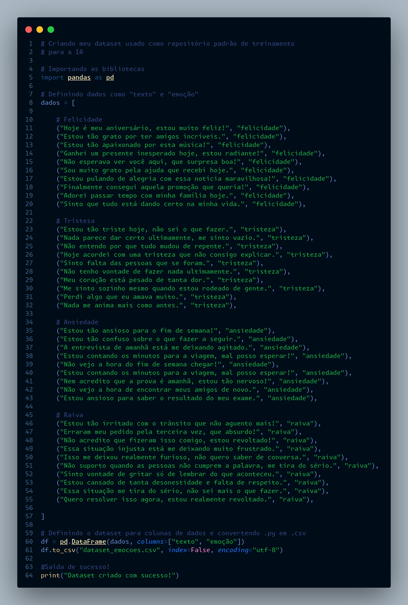
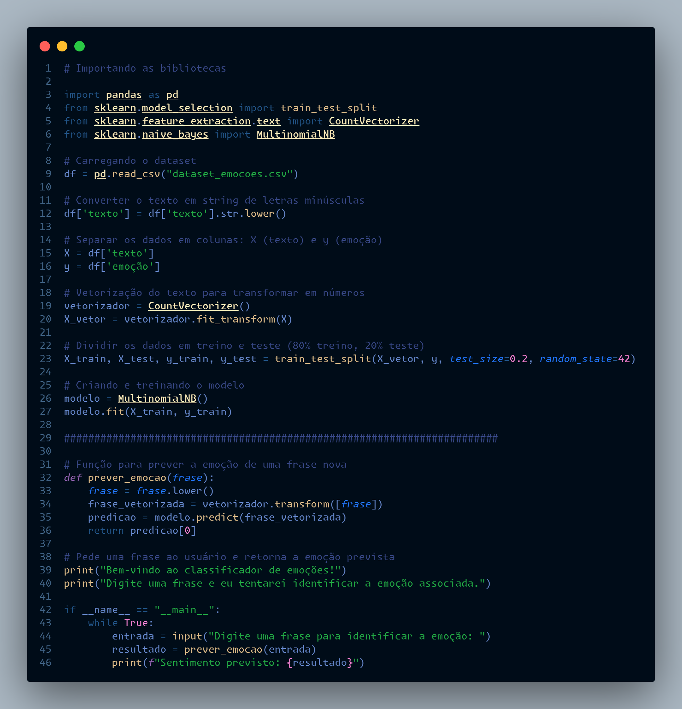

# 🧠 Formação - "Fundamentos do Mundo da Inteligência Artificial - ALURA"

🧑🏽‍💻 Este repositório hospeda meus documentos de todo o desenvolvimento na formação "Fundamentos do mundo da Inteligência Artificial" pela plataforma Alura.

---

## 💡 Sobre o Projeto

Este repositório contém os materiais e códigos desenvolvidos ao longo da formação em Inteligência Artificial da Alura. A formação aborda os principais fundamentos da IA com foco prático em Python,
incluindo aprendizado supervisionado, não supervisionado, redes neurais, NLP (Processamento de Linguagem Natural) e ferramentas como Scikit-learn e TensorFlow.

Durante a formação, diversos temas foram introduzidos e praticados por meio de exercícios e desafios. Ao final, foi desenvolvido um projeto prático, com o objetivo de aplicar 
os conceitos estudados e construir uma Inteligência Artificial funcional, explorando técnicas como aprendizado supervisionado, redes neurais, processamento de linguagem 
natural (NLP), entre outros.

---

## 🛠️ Tecnologias Utilizadas

- Python 3.11
- Visual Studio Code
- Google Colab
- Alura (plataforma de ensino)

## 📚 Bibliotecas

- Pandas - Manipulação e análise de dados
- NumPy - Operações matemáticas e vetoriais
- Matplotlib - Visualização de dados
- Scikit-learn - Algoritmos de Machine Learning

---

## 📂 Estrutura do Repositório

- `/final_project/`: Arquivos de código do projeto final desenvolvido
- `/fundamentos_IA/`: Arquivos de código de atividades propostas durante o curso de fundamentos da inteligência artificial
- `/machine_learning/`: Arquivos de código de atividades propostas durante o curso de Machine Learning
- `README.md`: Este arquivo
  
---

## 💭 Planejamento de Projeto

Ao concluir a formação "Fundamentos do Mundo da Inteligência Artificial" da Alura, desenvolvi um agente inteligente utilizando a abordagem de aprendizado supervisionado, aplicando na prática os principais conceitos estudados ao longo do curso.

A ideia central do projeto foi criar uma Inteligência Artificial capaz de receber uma frase como input e identificar o sentimento humano associado a ela, classificando-o entre alegria, tristeza, raiva ou ansiedade. O modelo foi treinado com um conjunto de dados rotulado, desenvolvido manualmente para o projeto, utilizando técnicas de Processamento de Linguagem Natural (NLP) e classificação de texto.

---

## 🧑🏽‍💻 Criação do DataSet "Emoções"

O ponto de partida do projeto foi a criação de um dataset personalizado, nomeado "Emoções", composto por frases rotuladas de acordo com a emoção expressa: alegria, tristeza, raiva ou ansiedade.

Cada entrada do conjunto de dados representa uma frase associada a uma dessas emoções, permitindo o treinamento supervisionado do modelo. A construção manual do dataset foi essencial para garantir exemplos realistas e relevantes, promovendo um aprendizado mais eficaz por parte da IA.

Este dataset foi utilizado como base para as etapas de pré-processamento, vetorização e treinamento do classificador.

## 📝 Exemplo de dados

| Frase                                 | Emoção    |
| ------------------------------------- | --------- |
| Hoje o dia está incrível!             | alegria   |
| Não aguento mais essa situação.       | raiva     |
| Me sinto tão sozinho e perdido.       | tristeza  |
| Tenho uma prova amanhã e estou tenso. | ansiedade |

🔗 [Ver script de criação do dataset](./final_project/dataset_emocoes.py)

---

## 🧑🏽‍💻 Criação do Script de Definição e Treino da Inteligência Artificial

Nesta etapa, foi desenvolvido o script responsável por toda a lógica de definição, pré-processamento e treinamento do modelo de Inteligência Artificial para análise de sentimentos.

O script contempla as seguintes etapas principais:

- **Carregamento do dataset** "Emoções", que contém frases rotuladas com as emoções correspondentes (alegria, tristeza, raiva e ansiedade).

- **Pré-processamento dos dados**, incluindo:  
  - Limpeza textual (remoção de pontuação, caracteres especiais e conversão para caixa baixa).  
  - Tokenização das frases para fragmentar o texto em palavras.  
  - Vetorização utilizando técnicas como TF-IDF para transformar texto em vetores numéricos compreensíveis pelo modelo.

- **Definição do modelo de aprendizado supervisionado**, escolhendo algoritmos adequados para classificação de texto. No projeto, foi utilizado Multinomial, devido à sua eficácia em tarefas de NLP.

- **Treinamento do modelo** com o dataset pré-processado, incluindo divisão dos dados em conjuntos de treino e teste para validação do desempenho.

- **Avaliação do modelo** utilizando métricas como acurácia, precisão, recall e F1-score, garantindo que o agente inteligente esteja apto a classificar corretamente os sentimentos nas frases.

- **Salvamento do modelo treinado** para uso posterior na aplicação prática, facilitando a reutilização sem necessidade de re-treinamento.

Todo o desenvolvimento foi realizado com foco em criar um pipeline robusto e eficiente para o reconhecimento de emoções em texto, aplicando os conceitos aprendidos durante a formação em Inteligência Artificial da Alura.

🔗 [Ver script de criação do dataset](./final_project/dataset_emocoes.py)

---

## 📷 Imagens do Resultado

A seguir, algumas capturas de tela que ilustram o funcionamento do projeto e os resultados obtidos após o treinamento do modelo de Inteligência Artificial para análise de sentimentos:

### DataSet "Emoções":

### Script Inteligência Artificial:

### Exemplo de Funcionamento da Saída: 

---

## 👤 Sobre o Autor

Desenvolvido por **Vitor Henrique Carvalho de Morais**, estudante de Engenharia da Computação na **Universidade Federal de Uberlândia (UFU)**.

- 💼 [Portfólio](https://vhcdev.netlify.app/)
- 🐙 [GitHub](https://github.com/Vhcmorais)
- ✉️ vhcmdev@gmail.com

Sinta-se à vontade para explorar o repositório, deixar sugestões ou entrar em contato! 🚀
